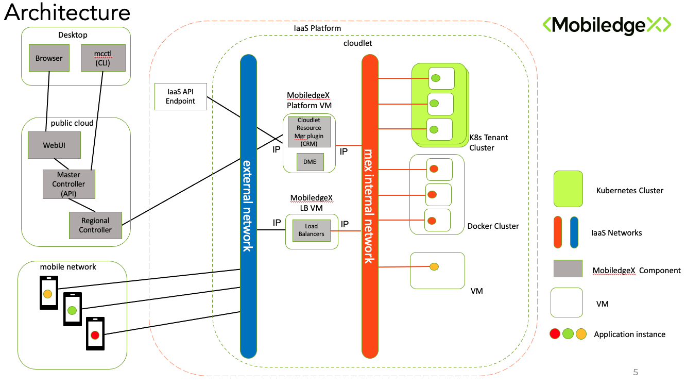

# Overview

Cloudlets are a collection of compute and network resources in an IaaS system, that are made available to MobiledgeX for the deployment of cloud workloads. These resources are made available by an IaaS Operator to MoibiledgeX via a Tenant, Service Account or other means of authentication (tenant) to IaaS stack. The Operator allocates resources to the tenant as they see fit but in-line with the minimum resource requirements specified by MobiledgeX. A singlge VM is deployed to the IaaS to run the MobiledgeX Cloudlet Resource Manage (CRM) plugin.
The CRM provides the IaaS agnostic interface between MobiledgeX regional and global controllers that service all cloudlets worldwide. 

The resources typically comprise an allocation of vCPU's, RAM, Disk and GPU via a pool of physical servers or VM's, along with an internal network for inter cluster (VM) communuication, and an external network to provide access from the internet. This diagram shows the most simplified view of the Networks Architecture relating to a cloudlet.

It also possible in some cases to have multiple external neworks, e.g. seperating the mobile wireless network from general inernet access network.

# CRM Installation Methods

There are 2 stages to installing a CRM in an IaaS stack to make a cloudlet.

1. Create the Cloudlet in the MobiledgeX system. This is done via the API or the [MobiledgeX console](console.mobiledgex.com).
2. Create the PlatformVM in the IaaS system and install the CRM container

The way these 2 steps are run depends on the access that is provided to the IaaS API endpoint. If the endpoint is publicly accessible or MobiledgeX controller can be given access to the endpint, then the cloudlet can be deployed directly from the MobiledgeX UI/console as a single instruction. This is known as "Direct" access. If the endpoint is not accessible then deployement is done with "Restricted" access. In this case step 1 wll generate a manifest to be used in the IaaS stack to accomplish step 2. The Operator would typically run step 2 in this case, or give MobiledgeX temporary access to run the manifest themselves.

Please visit the page relevant to your IaaS stack to find details or the specific deployment options and resource requirements.